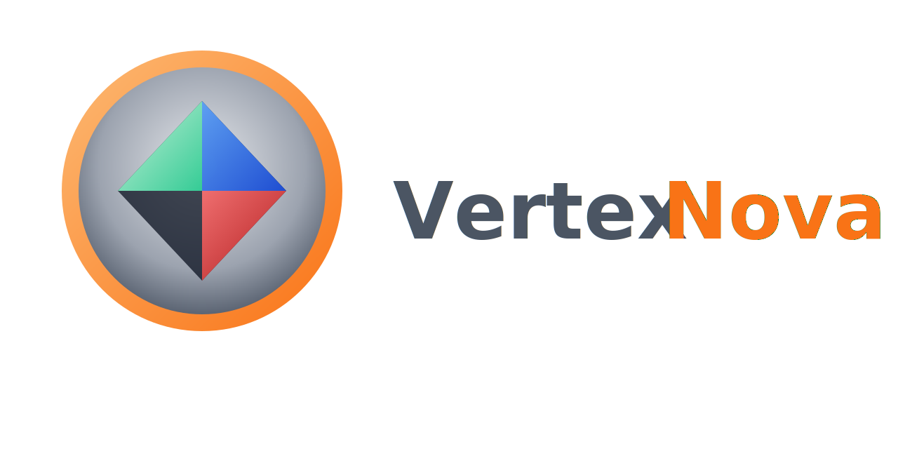

# VertexNova Events

<p align="center">
  
</p>

<p align="center">
  <strong>A lightweight, thread-safe event system for games and interactive applications</strong>
</p>

<p align="center">
  <a href="https://github.com/vertexnova/vneevents/actions/workflows/ci.yml">
    
  </a>
  <a href="https://codecov.io/gh/vertexnova/vneevents">
    
  </a>
  
  
</p>

---

## About

**VertexNova Events** (VneEvents) is a modern C++ event library that provides type-safe input events, a thread-safe queue, and a listener-dispatcher model. It is designed for use in games, tools, and any application that needs keyboard, mouse, touch, and window events with minimal dependencies.

For **architecture and design details** (event flow, components, best practices), see the [Event System](docs/events/events.md) and [Input System](docs/input/input.md) documentation.

## Features

- **Type-safe events** — Strongly typed event classes for keyboard, mouse, window, and touch
- **Modifier support** — Shift, Ctrl, Alt, Super (and optional Cmd) on key and mouse events
- **Touch** — Touch press, move, and release; can be emulated from mouse (e.g. LMB → touch id 0)
- **Thread-safe** — Event queue and dispatcher use read-write locks for safe concurrent use
- **Flexible usage** — EventBus for queued processing or direct dispatch
- **Input polling** — Static `Input` API for per-frame keyboard, mouse, and button state
- **Modern C++17** — `std::shared_mutex`, `[[nodiscard]]`, structured bindings
- **Optional logging** — Integrates with [vnelogging](https://github.com/vertexnova/vnelogging) when available

## Quick Start

### Include the library

```cpp
#include <vertexnova/events/events.h>

using namespace vne::events;
```

### Create an event listener

```cpp
class MyListener : public EventListener {
public:
    void onEvent(const Event& event) override {
        if (event.type() == EventType::eKeyPressed) {
            auto& e = static_cast<const KeyPressedEvent&>(event);
            std::cout << "Key " << static_cast<int>(e.keyCode())
                      << " mods=" << static_cast<int>(e.modifiers()) << std::endl;
        }
    }
};
```

### Register and process events

```cpp
auto& manager = EventManager::instance();

auto listener = std::make_shared<MyListener>();
manager.registerListener(EventType::eKeyPressed, listener);

manager.pushEvent(std::make_unique<KeyPressedEvent>(KeyCode::eA));
manager.pushEvent(std::make_unique<MouseMovedEvent>(100.0, 200.0));

manager.processEvents();
```

### Poll input state

```cpp
if (Input::isKeyPressed(static_cast<int>(KeyCode::eW)))
    ; // move forward

if (Input::isMouseButtonJustPressed(0)) {
    auto [x, y] = Input::mousePosition();
    // handle click at (x, y)
}

Input::nextFrame();  // call once per frame
```

## Event types

| Event class | EventType | Category |
|-------------|-----------|----------|
| `KeyPressedEvent` | `eKeyPressed` | Keyboard, Input |
| `KeyReleasedEvent` | `eKeyReleased` | Keyboard, Input |
| `KeyRepeatEvent` | `eKeyRepeat` | Keyboard, Input |
| `KeyTypedEvent` | `eKeyTyped` | Keyboard, Input |
| `MouseButtonPressedEvent` | `eMouseButtonPressed` | MouseButton, Input |
| `MouseButtonReleasedEvent` | `eMouseButtonReleased` | MouseButton, Input |
| `MouseButtonDoubleClickedEvent` | `eMouseButtonDoubleClicked` | MouseButton, Input |
| `MouseMovedEvent` | `eMouseMoved` | Mouse, Input |
| `MouseScrolledEvent` | `eMouseScrolled` | Mouse, Input |
| `WindowCloseEvent` | `eWindowClose` | Window |
| `WindowResizeEvent` | `eWindowResize` | Window |
| `WindowFocusEvent` | `eWindowFocus` | Window |
| `TouchPressEvent` | `eTouchPress` | TouchScreen, Input |
| `TouchReleaseEvent` | `eTouchRelease` | TouchScreen, Input |
| `TouchMoveEvent` | `eTouchMove` | TouchScreen, Input |

## Building

### Requirements

- CMake 3.16+
- C++17 compiler (GCC 8+, Clang 7+, MSVC 2019+)

### Build

```bash
git clone --recurse-submodules https://github.com/vertexnova/vneevents.git
cd vneevents

cmake -B build -DCMAKE_BUILD_TYPE=Release -DBUILD_TESTS=ON -DBUILD_EXAMPLES=ON
cmake --build build
ctest --test-dir build
```

### CMake options

| Option | Default | Description |
|--------|---------|-------------|
| `BUILD_TESTS` | ON | Build the test suite |
| `BUILD_EXAMPLES` | OFF | Build example programs |
| `ENABLE_COVERAGE` | OFF | Enable code coverage (Debug) |

Platform-specific scripts are in [`scripts/`](scripts/README.md) (e.g. `build_linux.sh`, `build_macos.sh`).

## Examples

When built with `-DBUILD_EXAMPLES=ON`, the following example programs are available:

| Example | Description |
|---------|-------------|
| [01_hello_events](examples/01_hello_events) | Event listeners, registration, pushing, and processing; keyboard, mouse, and window events. |
| [02_input_polling](examples/02_input_polling) | Input state polling with `Input::isKeyPressed()`, mouse position/buttons, and `nextFrame()`. |
| [03_event_listeners](examples/03_event_listeners) | Multiple listeners per event type, subsystem listeners, and dynamic register/unregister. |
| [04_multithreaded_events](examples/04_multithreaded_events) | Thread-safe event queue with concurrent event pushing and listener registration. |
| [05_game_loop_integration](examples/05_game_loop_integration) | Game loop with event processing, input polling, and per-frame state. |
| [06_glfw_integration](examples/06_glfw_integration) | GLFW + OpenGL window; logs events (key, mouse, touch, modifiers) and input polling; ESC or close to exit. |

Each example has its own [README](examples/01_hello_events/README.md) with build and run instructions. Run from the build tree, for example:

```bash
cmake -B build -DBUILD_EXAMPLES=ON
cmake --build build
./build/bin/examples/example_01_hello_events
# or: example_06_glfw_integration (needs GLFW; desktop only)
```

## Integration

### As a submodule

```bash
git submodule add https://github.com/vertexnova/vneevents.git libs/vneevents
```

```cmake
add_subdirectory(libs/vneevents)
target_link_libraries(your_target PRIVATE vne::events)
```

### Using FetchContent

```cmake
include(FetchContent)
FetchContent_Declare(
    vneevents
    GIT_REPOSITORY https://github.com/vertexnova/vneevents.git
    GIT_TAG        main
)
set(BUILD_EXAMPLES OFF)
FetchContent_MakeAvailable(vneevents)

target_link_libraries(your_target PRIVATE vne::events)
```

### Installed package

```cmake
find_package(VneEvents REQUIRED)
target_link_libraries(your_target PRIVATE vne::events)
```

## Documentation

- [Event system](docs/events/events.md) — Architecture, components, and usage
- [Input system](docs/input/input.md) — Polling and input handling
- [API (Doxygen)](docs/README.md) — Generate with `-DENABLE_DOXYGEN=ON`

## Platform support

| Platform | Status |
|----------|--------|
| Windows | ✅ |
| Linux | ✅ |
| macOS | ✅ |
| iOS | ✅ |
| Android | ✅ |
| Web (Emscripten) | ✅ |

## License

Licensed under the Apache License, Version 2.0.

## Author

Ajeet Singh Yadav — [yadav.ajeetsingh2020@gmail.com](mailto:yadav.ajeetsingh2020@gmail.com)
